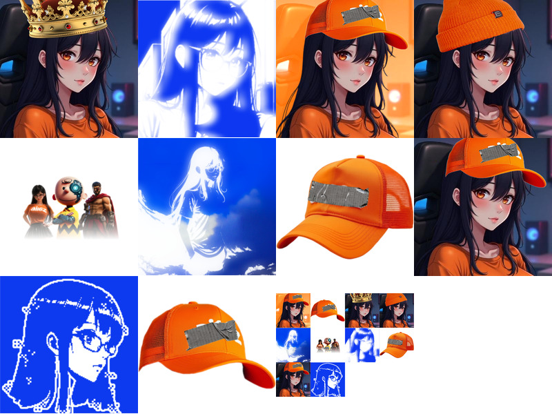
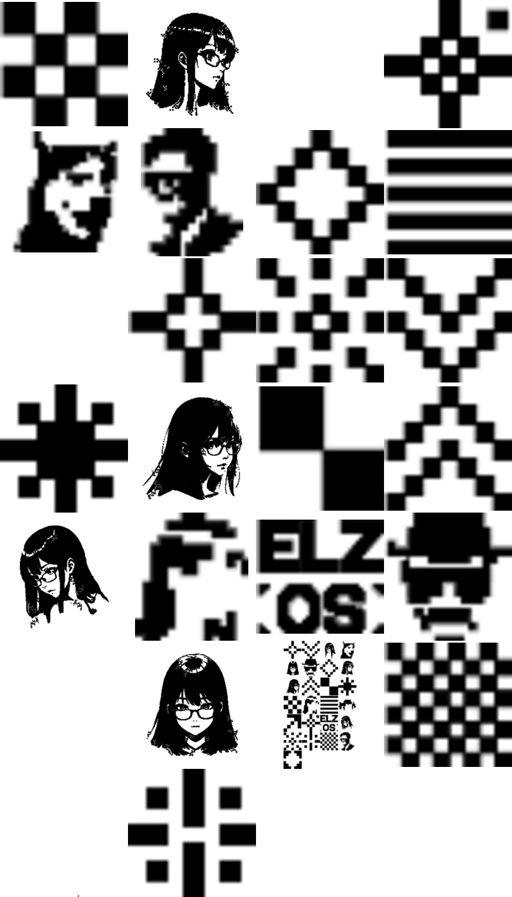
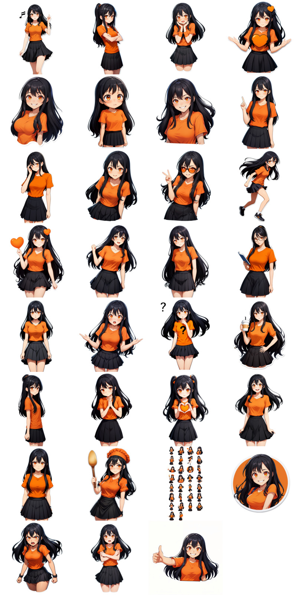
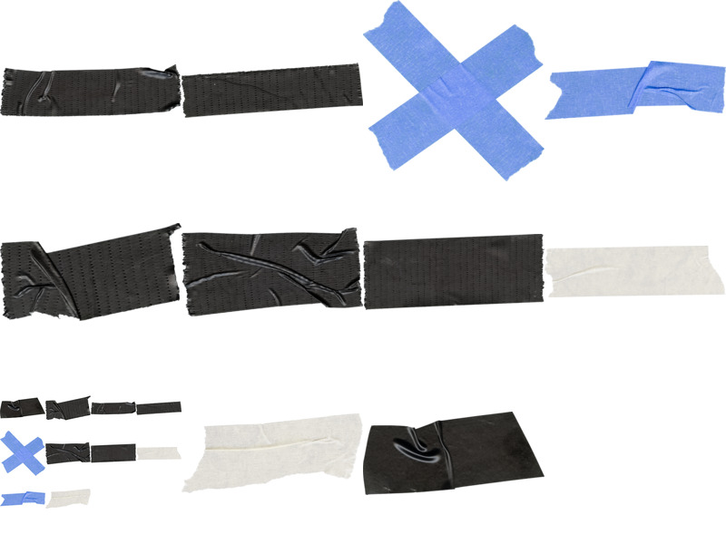
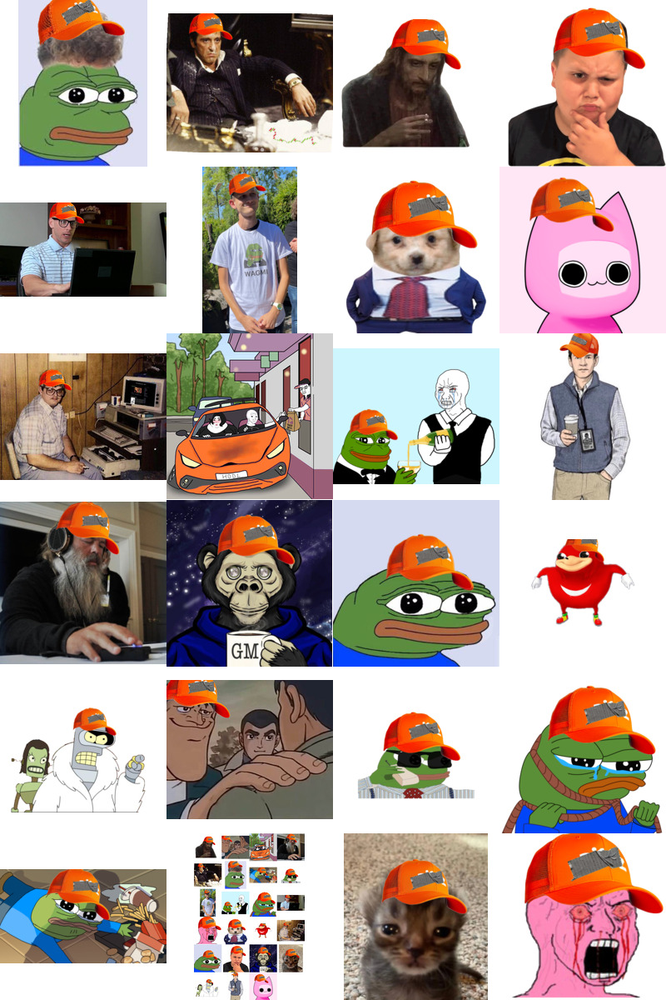

# Media Assets

This directory contains the following media assets:

| File | Preview |
|------|---------|
| [logo_eliza_OS_light.svg](logo_eliza_OS_light.svg) |  |
| [logo_eliza_OS_dark.png](logo_eliza_OS_dark.png) |  |
| [logo_eliza_OS_light.png](logo_eliza_OS_light.png) |  |
| [Screenshot_2025-03-18_21-34-45.png](Screenshot_2025-03-18_21-34-45.png) |  |
| [banner2.png](banner2.png) |  |
| [hat.glb](hat.glb) | No preview available |
| [banner.png](banner.png) |  |
| [logo_eliza_OS_dark.svg](logo_eliza_OS_dark.svg) |  |
| [ELIZAOS_BOX.glb](ELIZAOS_BOX.glb) | No preview available |
| [magnifics_upscale-EK1Ez7nSQQ9LMNrg4W3M-americaokay2.png](magnifics_upscale-EK1Ez7nSQQ9LMNrg4W3M-americaokay2.png) |  |

## media

### Montage of 11 images

## media/Light

| File | Preview |
|------|---------|
| [site.webmanifest](media/Light/site.webmanifest) | No preview available |
| [favicon-32x32.png](media/Light/favicon-32x32.png) |  |
| [android-chrome-192x192.png](media/Light/android-chrome-192x192.png) |  |
| [favicon-16x16.png](media/Light/favicon-16x16.png) |  |
| [android-chrome-512x512.png](media/Light/android-chrome-512x512.png) |  |
| [apple-touch-icon.png](media/Light/apple-touch-icon.png) |  |

## media/Light/favicon

| File | Preview |
|------|---------|
| [favicon-32x32.png](media/Light/favicon/favicon-32x32.png) |  |
| [android-chrome-192x192.png](media/Light/favicon/android-chrome-192x192.png) |  |
| [favicon-16x16.png](media/Light/favicon/favicon-16x16.png) |  |
| [android-chrome-512x512.png](media/Light/favicon/android-chrome-512x512.png) |  |
| [apple-touch-icon.png](media/Light/favicon/apple-touch-icon.png) |  |

## media/Light/PNG

### Montage of 32 images

## media/Light/SVG

### Montage of 26 images

## media/Dark

## media/Dark/PNG

### Montage of 32 images

## media/Dark/SVG

### Montage of 26 images

## media/stickers

### Montage of 31 images

## media/tape

### Montage of 11 images

## media/memes

| File | Preview |
|------|---------|
| [Screenshot_2024-10-24_at_9.48.18_PM.png](media/memes/Screenshot_2024-10-24_at_9.48.18_PM.png) |  |
| [emoji-cheers.png](media/memes/emoji-cheers.png) |  |
| [emoji-biz.png](media/memes/emoji-biz.png) |  |
| [Screenshot_2024-10-24_at_9.48.18d_PM.png](media/memes/Screenshot_2024-10-24_at_9.48.18d_PM.png) |  |
| [emoji-salue.png](media/memes/emoji-salue.png) |  |
| [AIDegenSpartan.png](media/memes/AIDegenSpartan.png) |  |

## memes

### Montage of 24 images

## logos

| File | Preview |
|------|---------|
| [logo_eliza_OS_light.svg](logos/logo_eliza_OS_light.svg) |  |
| [logo_eliza_OS_dark.png](logos/logo_eliza_OS_dark.png) |  |
| [logo_eliza_OS_light.png](logos/logo_eliza_OS_light.png) |  |
| [logo_eliza_OS_dark.svg](logos/logo_eliza_OS_dark.svg) |  |
| [ElizaOS_black.glb](logos/ElizaOS_black.glb) | No preview available |
| [ElizaOS_white.glb](logos/ElizaOS_white.glb) | No preview available |
| [ElizaOS_orange.glb](logos/ElizaOS_orange.glb) | No preview available |

## scripts

| File | Preview |
|------|---------|
| [previews.py](scripts/previews.py) | No preview available |

## avatars

| File | Preview |
|------|---------|
| [eliza_hat.vrm](avatars/eliza_hat.vrm) | No preview available |

